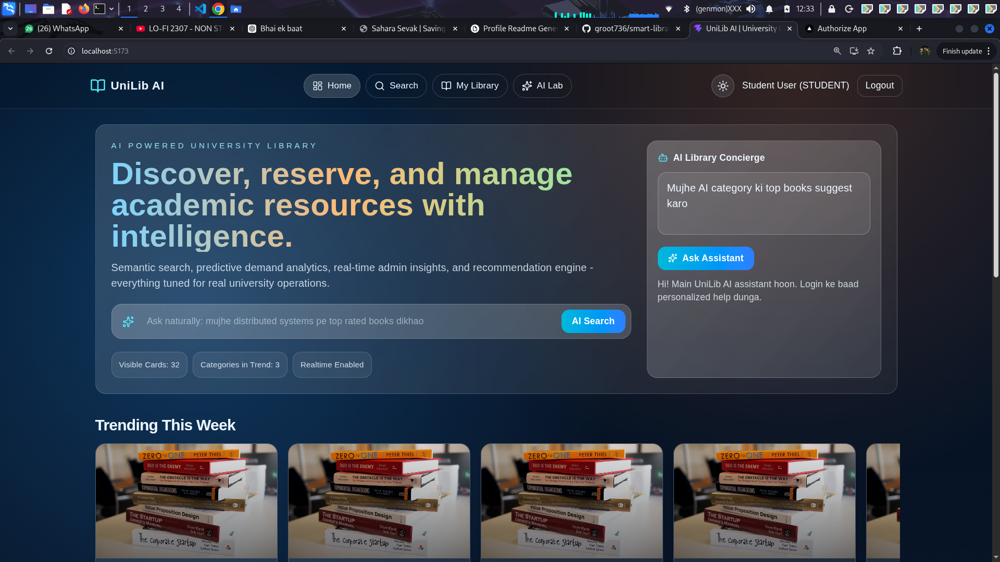

# 🚀 UniLib AI — University Library Management SaaS

<p align="center">
  <b>AI-powered smart library ecosystem for modern universities</b><br/>
  Built with scalability, intelligence & real-world production architecture 🎓
</p>

<p align="center">
  <a href="https://github.com/groot736/smart-library/stargazers">
    
  </a>
  <a href="https://github.com/groot736/smart-library/network">
    
  </a>
  
  
</p>

---

## 🎬 Live Demo

<p align="center">
  <a href="https://web-six-chi-77.vercel.app">
    
  </a>
</p>

---

## 🖼️ Preview

<p align="center">
  
</p>

> ⚠️ Put your screenshot inside: `assets/demo.png` in your repo

---

## 🌟 Overview

**UniLib AI** is a **full-stack SaaS platform** that transforms traditional university libraries into **AI-powered intelligent ecosystems**.

It combines **semantic search, real-time analytics, role-based dashboards, and intelligent recommendations** — all built with a **production-grade architecture**.

---

## 🧠 Core Features

* 🤖 AI Semantic Search & Smart Recommendations
* 📊 Realtime Analytics Dashboard (Socket.IO)
* 🔐 Role-Based Access Control (RBAC)
* 📡 Modular Scalable Backend
* 📱 Progressive Web App (PWA)
* ⚡ High-performance UI

---

## 🎭 User Roles

| Role          | Capabilities                             |
| ------------- | ---------------------------------------- |
| 🎓 Student    | Search, issue/return, reserve, dashboard |
| 👨‍🏫 Faculty | Manage approvals & reservations          |
| 🛡️ Admin     | Full control panel & analytics           |

---

## 🛠️ Tech Stack

**Frontend:** React • Vite • Tailwind CSS • Framer Motion • Chart.js • Zustand
**Backend:** Node.js • Express • TypeScript • Prisma • JWT • Socket.IO
**Database:** PostgreSQL
**AI Layer:** Semantic Search • Recommendations • Forecasting • Chatbot
**DevOps:** Docker • Docker Compose

---

## 🏗️ Project Structure

```bash id="v8o1j9"
apps/
  web/   → Frontend (React + PWA)
  api/   → Backend (REST + Services)

docs/
  API.md
  SCHEMA.md
  ARCHITECTURE.md
```

---

## ⚡ Quick Start

```bash id="7p6c1z"
npm install
npm run setup:local
docker compose up -d postgres
cp apps/api/.env.example apps/api/.env

npm run prisma:generate -w apps/api
npm run prisma:migrate -w apps/api
npm run prisma:seed -w apps/api

npm run dev
```

---

## 🌐 Local Access

* API → http://localhost:4000
* Web → http://localhost:5173

---

## 🔐 Security

* JWT Authentication
* Role-based Authorization
* Zod Validation
* Helmet & CORS
* bcrypt Password Hashing

---

## 🤖 AI Capabilities

* Natural Language Search
* Personalized Recommendations
* Demand Forecasting
* AI Chatbot Assistant
* AI Study Mode (Notes + MCQs + Summary)
* Predictive Book Availability
* Gamification System
* Auto Tag Generation

---

## ⚡ Advanced Features

* 📡 Socket.IO Realtime Updates
* 📥 Reservation Queue
* 💰 Fine Management
* 🔔 Notification Simulation
* 📷 Barcode/RFID API
* 🎤 Voice Search
* 📖 Digital Reader

---

## 🎨 UI Highlights

* Glassmorphism Design ✨
* Dark / Light Mode 🌗
* Netflix-style UI 🎬
* Smooth Animations

---

## 🚀 Deployment

🌍 Live: https://web-six-chi-77.vercel.app

Frontend → Vercel
Backend → Render / Railway
Database → PostgreSQL

---

## 🏆 Why This Project?

✅ Real SaaS Architecture
✅ AI + Full Stack + DevOps
✅ Production-ready
✅ Perfect for Resume / Placements

---

## 👨‍💻 Author

**Subhadeep Mondal**
🔗 https://github.com/groot736

---

## 💖 Support

⭐ Star this repo
🍴 Fork it
🚀 Share it

---

<p align="center">
  <b>🔥 Building the future of intelligent libraries 🔥</b>
</p>
